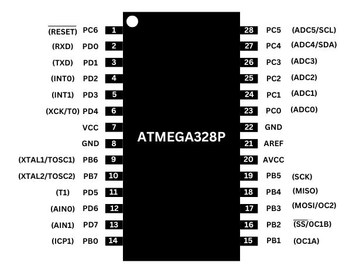

# HEXA-LINK Robotic Arm 🤖

> A Bluetooth-controlled 6-DOF robotic arm developed as a diploma project in Automation & Robotics Engineering.


---

## 📌 Project Overview

**HEXA-LINK** is a 6-degree-of-freedom robotic arm developed as a diploma project in Automation & Robotics Engineering.

The robotic arm is controlled wirelessly using a custom Android application through an **HC-05 Bluetooth module**. An **ATmega328P microcontroller** processes the received commands and controls six servo motors through a **PCA9685 16-channel PWM servo driver**.

The mechanical structure of the arm was developed using **3D-printed components**, while a custom PCB was designed and fabricated for the electronic control system.

---

## ✨ Key Features

- 🤖 6 Degrees of Freedom (6-DOF)
- 📱 Custom Android control application
- 📡 Wireless Bluetooth communication
- 🔵 HC-05 Bluetooth module
- 🧠 ATmega328P microcontroller
- 🎛️ PCA9685 16-channel PWM servo driver
- ⚙️ Six servo motors
- 🖨️ 3D-printed mechanical structure
- 🔌 Custom-designed PCB
- 🔧 Custom electronic circuit and connections

---

## 🏗️ System Architecture

The overall control flow of the robotic arm is:

```text
Android Application
        │
        │ Bluetooth
        ▼
    HC-05 Module
        │
        ▼
    ATmega328P
        │
        ▼
      PCA9685
        │
        ▼
    Servo Motors
        │
        ▼
  6-DOF Robotic Arm
```

### Block Diagram


---

## ⚙️ Working Principle

1. The user selects a movement command using the Android application.
2. The command is transmitted wirelessly through Bluetooth.
3. The **HC-05 Bluetooth module** receives the command.
4. The **ATmega328P** processes the received command.
5. The ATmega328P sends the required control instructions to the **PCA9685 servo driver**.
6. The PCA9685 generates PWM signals for the servo motors.
7. The six servo motors move the robotic arm according to the selected command.

---

## 🔩 Hardware Components

| Component | Purpose |
|---|---|
| ATmega328P | Main microcontroller |
| PCA9685 | Multi-channel PWM servo control |
| HC-05 | Bluetooth communication |
| Servo Motors | Robotic arm actuation |
| 7805 Voltage Regulator | Voltage regulation |
| Crystal | Microcontroller clock |
| Custom PCB | Electronic control and connections |
| 3D Printed Parts | Mechanical structure |

---

## 🧠 Main Controller

### ATmega328P

The **ATmega328P** acts as the main controller of the robotic arm.

It receives commands from the HC-05 Bluetooth module and processes them before sending the required control instructions to the PCA9685 servo driver.



---

## 🎛️ Servo Driver

### PCA9685

The **PCA9685** is used as the PWM servo driver for controlling the six servo motors of the robotic arm.

It provides multiple PWM channels, allowing the servo motors to be controlled independently.

---

## 📡 Bluetooth Communication

### HC-05

The **HC-05 Bluetooth module** provides wireless communication between the Android application and the robotic arm controller.


---

## 🔌 Electronics

The electronic control system was developed around the ATmega328P, HC-05 Bluetooth module, PCA9685 servo driver and supporting components.

### Circuit Diagram


### Connection Diagram


### Schematic Diagram


---

## 🟦 PCB Development

A custom PCB was designed and fabricated for the robotic arm control electronics.

### PCB Design


### PCB 3D View


### PCB Etching Tracks


### PCB Fabrication


### Final PCB Board


### Soldered PCB


---

## 🤖 Mechanical Structure

The robotic arm uses a **3D-printed mechanical structure** designed to support the six servo-driven axes of movement.


---

## 📱 Android Application

A custom Android application was developed as the wireless control interface for the robotic arm.

The application communicates with the robotic arm using the **HC-05 Bluetooth module**.

### Communication Flow

```text
Android Application
        │
        │ Bluetooth
        ▼
      HC-05
        │
        ▼
    ATmega328P
        │
        ▼
     PCA9685
        │
        ▼
   Servo Motors
```

The compiled Android application is included in this repository:

`Android-App/roboticARM.apk`

> Note: The Android application source code is not included in this repository. Only the compiled APK is provided.

---

## 💻 Arduino Firmware

The Arduino firmware contains the control logic for the robotic arm.

The source code is available at:

`Arduino/HEXA-LINK-Robotic-Arm.ino`

---

## 📂 Project Structure

```text
HEXA-LINK-Robotic-Arm/
│
├── Arduino/
│   └── HEXA-LINK-Robotic-Arm.ino
│
├── Android-App/
│   └── roboticARM.apk
│
├── Electronics/
│   ├── Block-Diagram/
│   ├── Circuit-Diagram/
│   ├── PCB/
│   └── Schematic/
│
├── Images/
│   ├── Assembly/
│   │   └── Robotic ARM Assembled.jpeg
│   │
│   └── Electronics/
│       ├── Component Images
│       └── Hardware Reference Images
│
└── README.md
```

---

## 🛠️ Software & Tools

- Arduino IDE
- Embedded C/C++
- Android Application
- Bluetooth Communication
- EasyEDA
- PCB Design
- PCB Fabrication
- 3D Printing

---

## 🎯 Project Objectives

The main objectives of the project were:

- To design and develop a functional 6-DOF robotic arm.
- To implement wireless control using Bluetooth.
- To control multiple servo motors using the PCA9685.
- To develop a custom electronic control PCB.
- To design and fabricate a 3D-printed mechanical structure.
- To integrate hardware, firmware and Android-based control into one robotic system.

---

## 📚 Project Documentation

This repository contains the major technical documentation and development resources of the project, including:

- System block diagram
- Circuit diagram
- Connection diagram
- Electrical schematic
- PCB design
- PCB fabrication stages
- Arduino firmware
- Android control application
- Mechanical assembly photographs
- Electronic component references

---

## 🚀 Future Improvements

Possible future improvements include:

- Improved mechanical precision
- Better servo positioning
- Wi-Fi-based control
- Web-based robotic arm control
- Camera-based object detection
- Automated object picking and placement
- Feedback-based position control
- Computer vision integration

---

## 👨‍💻 Project Information

**Project:** HEXA-LINK Robotic Arm  
**Program:** Diploma in Automation & Robotics Engineering  
**Project Type:** Academic / Diploma Project  
**Control Method:** Bluetooth  
**Degrees of Freedom:** 6-DOF  
**Main Controller:** ATmega328P  
**Servo Driver:** PCA9685  
**Wireless Module:** HC-05  
**Control Interface:** Android Application  
**Mechanical Structure:** 3D Printed

---

## 📄 License

This project is provided for educational and portfolio purposes.

Please contact the repository owner before reusing the complete project commercially.

---

⭐ If you find this project useful or interesting, consider giving the repository a star.
